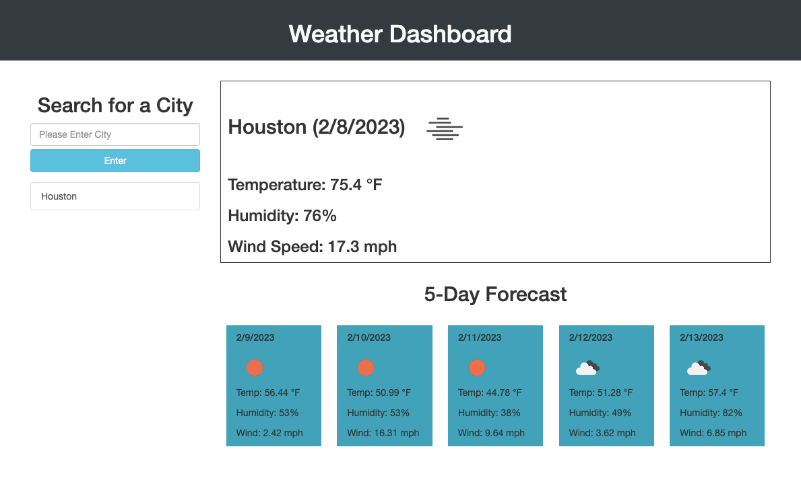
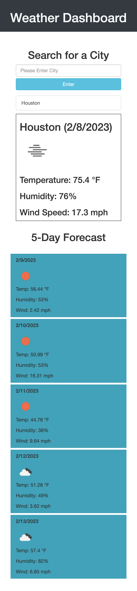

# Weather Dashboard: weather-dashboard-six

## Description

This is a web application showing how to use server-side APIs and bootstrap to design a current weather and five day forecast webpage. THe api used is OpenWeather and it uses links and an API key to allow access toits library of weather information based on city. The webpage uses this to search cities and display its current weather as well as the weather for the next five days. The webpage also saves the cities entered into the search bar to local storage so the next time the webpage is visited then a search history will be available to the user to click for their past weather searches.

## Task completed

- Added form input to search for cities
- Searched city appears along with the date using dayjs
- Current weather including weather icon, temperature, wind speed, and humitity appears according to city searched
- Future weather conditions appear with the same criteria below current date
- Any city searched will appear below search bar as a button for search history

## Link

[Link to deployed website](https://aarondreyer.github.io/weather-dashboard-six/)

[Link to Repository](https://github.com/AaronDreyer/weather-dashboard-six)

## Installation

Access application through github by deploying index.html, style.css, javascript, and README.md

Links above bring user to deployed page and github repository

## Usage

This application is used to view weather according to city and see the future predictions for that city for up to five days. This shows the dates for each, temperature, wind speed, humitity, and weather icon describing weather. This also shows the usage of server-side APIs, bootstrap, some jQuery, and dayjs to make a successful weather application.

Normal Application

Responsive Application (IPhone for reference)

## Credits

Credit for the total completion of assignment include: TAs, instructor, and students of the 2022 Georgia Tech Coding Bootcamp. Their assistance allowed for the assignment to meet all requirements.

Following Websites were used:

- https://stackoverflow.com/
- https://getbootstrap.com/
- https://youtu.be/QEu8_5bYm-w
- https://jquery.com/
- https://youtu.be/59QMudgnzdg
- https://github.com/topics/weather-dashboard?l=html&o=desc&s=

## License

License provided by Georgia Tech Bootcamp.

External liscense not specified.

